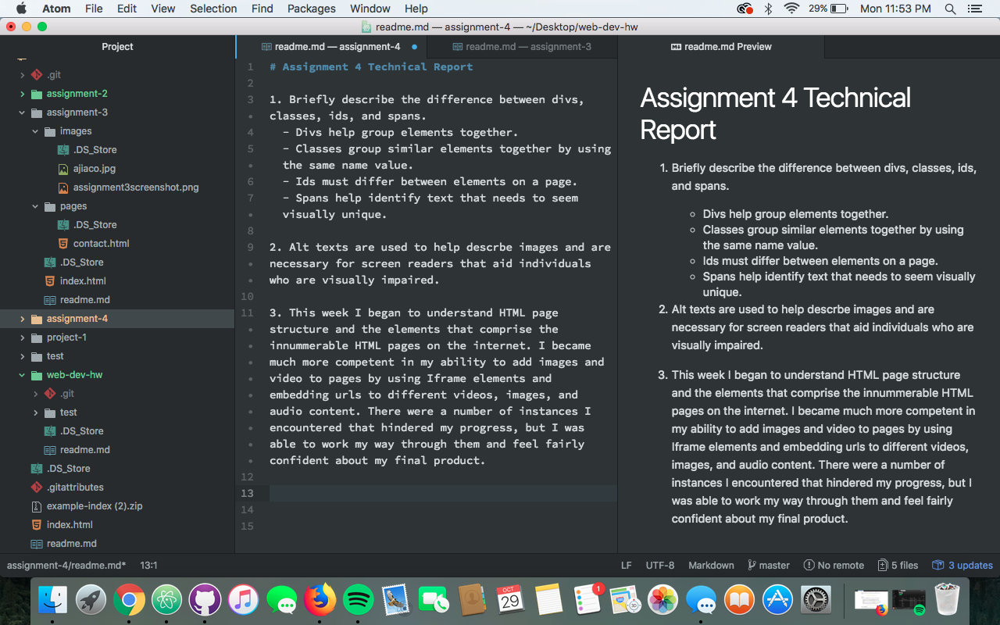

# Assignment 4 Technical Report

1. Briefly describe the difference between divs, classes, ids, and spans.
  - Divs help group elements together.
  - Classes group similar elements together by using the same name value.
  - Ids must differ between elements on a page.
  - Spans help identify text that needs to seem visually unique.

2. Alt texts are used to help descrbe images and are necessary for screen readers that aid individuals who are visually impaired.

3. This week I began to understand HTML page structure and the elements that comprise the innummerable HTML pages on the internet. I became much more competent in my ability to add images and video to pages by using Iframe elements and embedding urls to different videos, images, and audio content. There were a number of instances I encountered that hindered my progress, but I was able to work my way through them and feel fairly confident about my final product.

