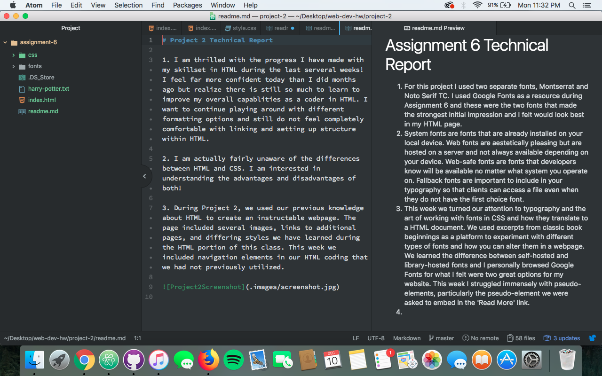

# Assignment 6 Technical Report

1. For this project I used two separate fonts, Montserrat and Noto Serif TC. I used Google Fonts as a resource during Assignment 6 and these were the two fonts that made the strongest initial impression and I felt would look best in my HTML page.
2. System fonts are fonts that are already installed on your local device. Web fonts are aestetically pleasing but are hosted on a server and not always available depending on your device. Web-safe fonts are fonts that developers know will be available no matter what system you operate on. Fallback fonts are important to include in your typography so that clients can access a file even when they do not have the first choice font.
3. This week we turned our attention to typography and the art of working with fonts in CSS and how they translate to a HTML document. We used excerpts from classic book beginnings as a platform to experiment with different types of fonts and how you can alter them in a webpage. We learned the difference between self-hosted and library-hosted fonts and I personally browsed Google Fonts for what I felt were two great options for my website. This week I struggled immensely with pseudo-elements, particularly the pseudo-element we were asked to embed in the 'Read More' link.

