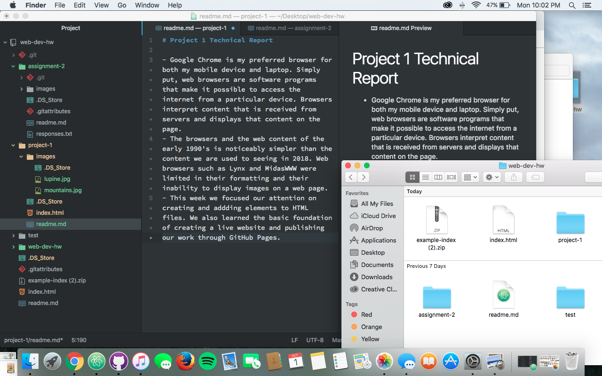

# Project 1 Technical Report

- Google Chrome is my preferred browser for both my mobile device and laptop. Simply put, web browsers are software programs that make it possible to access the internet from a particular device. Browsers interpret content that is received from servers and displays that content on the page.
- The browsers and the web content of the early 1990's is noticeably simpler than the content we are used to seeing in 2018. Web browsers such as Lynx and MidasWWW were limited in their formatting and their inability to display images on a web page.
- This week we focused our attention on creating and addding elements to HTML files. We also learned the basic foundation of creating a live website and publishing our work through GitHub Pages.
- This week I was unable to resize the image I included in the HTML document. I hope that in the coming weeks we will become more familiar with how to adjust styles and formatting in HTML files.

