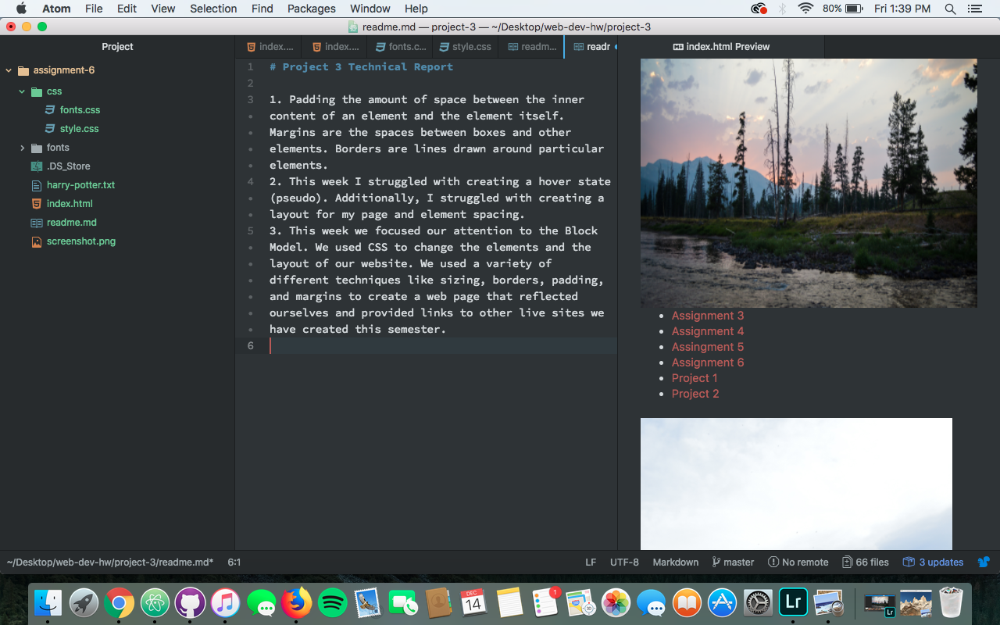

# Project 3 Technical Report

1. Padding the amount of space between the inner content of an element and the element itself. Margins are the spaces between boxes and other elements. Borders are lines drawn around particular elements.
2. This week I struggled with creating a hover state (pseudo). Additionally, I struggled with creating a layout for my page and element spacing.
3. This week we focused our attention to the Block Model. We used CSS to change the elements and the layout of our website. We used a variety of different techniques like sizing, borders, padding, and margins to create a web page that reflected ourselves and provided links to other live sites we have created this semester.

